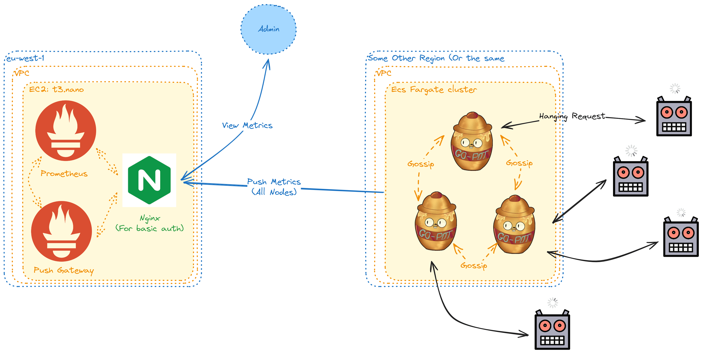

# Hosting Go Pot
This folder contains an example configuration for hosting `go-pot`. As part of this repository contains an example infrastructure for how this might look like:

# Deploying example infrastructure
> [!WARNING]  
> This is an example architecture, Not something that should be used as is in a real production environment. Certain elements (like secrets) are not secureley stored as part of the CDK code

This example uses [aws cdk](https://aws.amazon.com/cdk/) to handle the deploying the infrastructure given above. 

## Installing dependencies
For this example to work you will need the following installed:
* [Docker](https://docs.docker.com/get-docker/)
* [Node.js](https://nodejs.org/en/download/) (Reccomended istallation (via nvm)[https://github.com/nvm-sh/nvm])
* [Npm](https://www.npmjs.com/get-npm) (Automatically installed with Node.js in most cases)
* [Go lang](https://golang.org/doc/install) (Version 1.21 or higher)

## Deploying the infrastructure

In order to deploy this example architecture you will need to:
* Authenticate with AWS 
* [Bootstrap the cdk environment](https://docs.aws.amazon.com/cdk/v2/guide/bootstrapping.html)
* Run `npm run cdk -- diff --context="MetricsServerPassword=[CHANGE THIS TO A PASSWORD]"` and check the resources it is going to create
* Run  `npm run cdk -- deploy --context="MetricsServerPassword=[CHANGE THIS TO A PASSWORD]" --all`
* Look in AWS to find where pots have been deployed and visit them in your browser to see that they work
